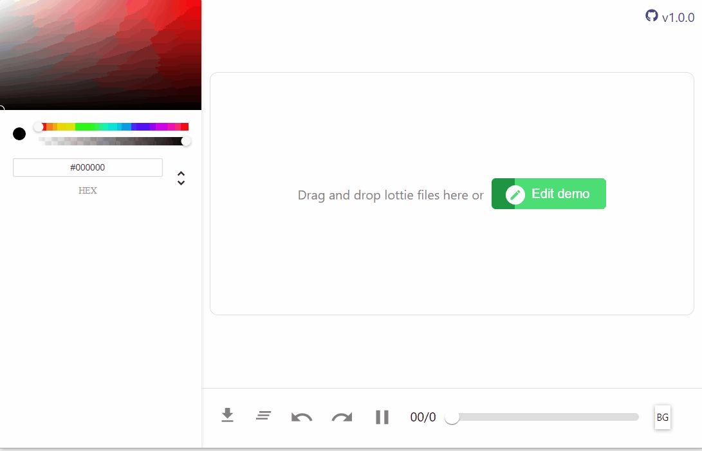

# lottie-editor
Edit lottie animation colors https://magna25.github.io/lottie-editor/

A simple web tool that parses a lottie json file and allows editing the layer colors.
The tool supports:
  * Grouping each color by layer name and group name
  * Editing solid colors
  * Editing gradients
  * Editing keyframed colors (both solids and gradients)
  * up to 10 levels of undo/redo history
  * keyboard shortcuts for play/pause, seek forward/backward
  * Drag and drop files
  * loading lottie file from url (get a link from lottiefiles and provide the source url. ex /?src="animation_url")
  
 The whole app runs on the client and any uploaded animation isn't saved on a server.
 
 
 ### Browser support
 I used Chrome while developing this so all the testing is done on there and you should too 
 
 Firefox and Edge have a flex-grow issue and the UI is a bit messed up on these browsers but the the functionality is the same.
 
 IE: you shouldn't be using it
 
 
 ### known issues
 Some lottie json files have inconsistent properties which cause the colors not to be parsed, for ex. there are layers embeded in another
 layers. This hopefully will be patched on the next release.
 
~~some key framed solids and gradients have a missing end color property-~~ this has been fixed for now but generally missing properties are some of the issues

some gradient colors don't change
 
 ### todo
 handle layers embeded inside another layers
 
 refactor code
 

 
 
